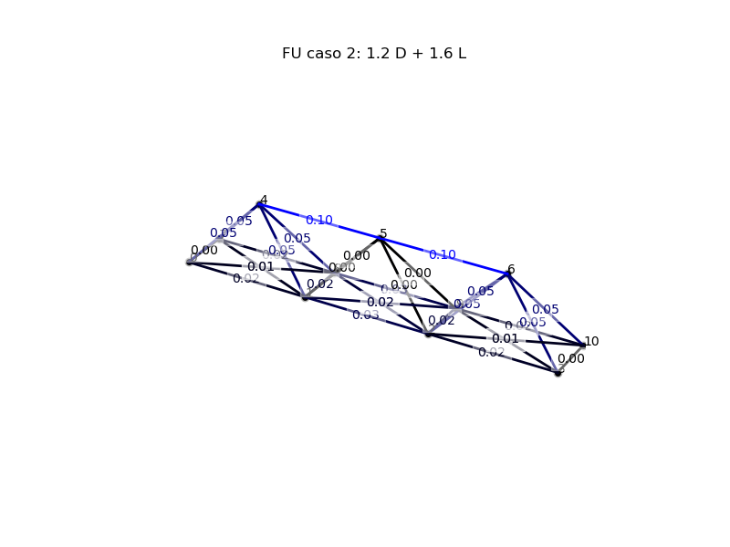
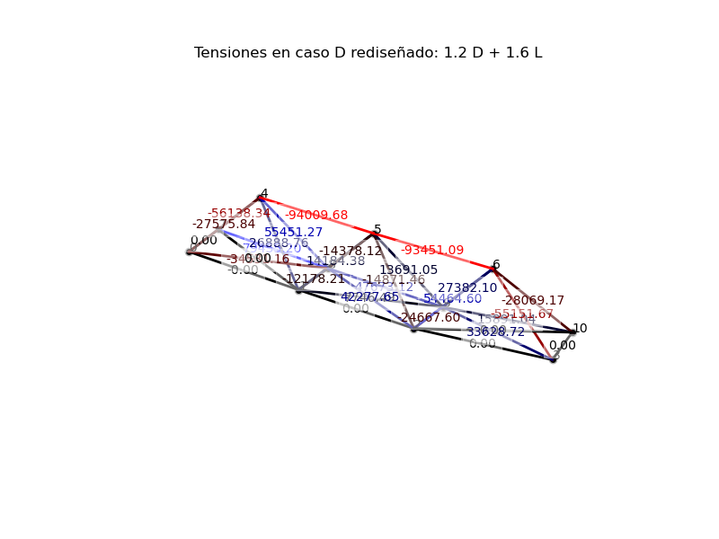

# MCOC2020-P2
MCOC2020-P2

Se eligieron las siguientes barras:

Barra 0 (0,1) 
Barra 1 (1,2)
Barra 2 (2,3)
Barra 23 (1,7)
Barra 26 (2,10)

Calculo manual:
En primer lugar, se calculo el área de la sección transversal de las barras, las cuales tienen un radio de 8 cm y 5 cm de espesor, obteniendo un área de 0.01727 m2.
Después, se calculó el largo de las barras diagonales, las que tienen un largo de 5.38 m2.
Luego, se procedió a calcular el peso de la barra a través de la densidad del acero (7850 kg/m3) y el volumen de las barras, lo que nos da un peso inicial de:

Barra 0: 678.1913140936966 Kg
Barra 1: 678.1913140936966 Kg
Barra 2: 678.1913140936966 Kg
Barra 23: 730.4343994323356 Kg
Barra 26: 730.4343994323356 Kg

Utilizando la norma LRFD (Φ=0.9) podemos obtener el valor del factor de utilización, para esto necesitamos el valor de la tensión máxima del acero (400 MPa) y el valor de las tensiones en el caso 1 (1.2D + 1.6L) para asi, maximizar el valor del FU. 

Por otra parte, se creo una lista de radios y espesores posibles, con los cuales se iba comparando el peso de las barras originales con el peso de las barras actuales, con el fin de minimizar esta variable. Se utilizó la condición de que el peso fuera menor para así, obtener los factores de utilizacion más altos que los existentes, pero menores que uno y cumpliendo con minimizar el peso. De esta manera, se pudo extraer de la lista los valores de radio y espesor que satisfacieran las condiciones mencionadas anteriormente.

Finalmente, se obtuvo que el radio debe ser igual a 1 cm, mientras que el espesor debe ser de 0.14 cm, para obtener los siguientes FU:

Barra 0: 0.3591688907326342
Barra 1: 0.9444432655928743
Barra 2: 0.3591688907326342
Barra 23: 0.4738414669319976
Barra 26: 0.4738414669319976

Y obteniendo un peso total de 20666.548941771813 Kg.

El desplazamiento maximo es 0.00725609613507172 m

Para disminuir el peso aun más, se podrían quitar las barras cuyas tensiones sean igual a 0, ya que estas no estan aportando en la estabilidad estructural del enrejado, sino que solo estan aportando en peso. Por ejemplo las barras 3(3,10) y 7(0,7), las cuales siempre tienen tensión 0, sea cual sea el área transversal de las barras.